# Not A Real Company (NARC) Website

> **Making Fake Work Feel Real Since 2025**
> A homelab-turned-faux-enterprise: infrastructure, policies, leadership drama, and memos included.

---

## What is this?

This is the official(ly fake) website for **Not A Real Company (NARC)**.

NARC is a parody enterprise environment built in a homelab to practice real-world IT, DevOps, and documentation workflows — but with a wink and a nudge.

Think of it as a **sandbox for corporate bureaucracy**: DNS servers, faux SaaS dashboards, internal documents, leadership bios, project tracking, Alpha Complex-style memos, and more.

---

## How it was built

- **Static Website** — Plain HTML, CSS, and JavaScript. No frameworks, no build pipeline. Designed to deploy directly to GitHub Pages or an NGINX server.
- **AI-assisted development** — Built and maintained across multiple structured sessions using Claude (Anthropic) and a multi-session project workflow with branching, working notes, and a canonical lore reference (the NARC Lore Bible).
- **Theme Toggle** — Light/dark mode via `js/theme.js`.
- **Documents & Projects Pages** — Markdown and PDF support. Files organized in `assets/docs/`, `assets/forms/`, and `assets/projects/`. Index JSON files drive dynamic card layouts. Project-specific artifacts are co-located in `assets/projects/[project-id]/` subdirectories.
- **Blog** — Staged in `blogs/` at site root. Full build is a future workstream (BR-004).
- **Styling** — All core look & feel in `css/style.css`.
- **Logos & Icons** — Fake-corporate SVG logos, favicons, officer portraits, and seal assets in `images/`.

---

## Structure

```
.
├── assets/
│   ├── docs/           # Corporate documents (Markdown)
│   ├── forms/          # Templates and forms
│   ├── projects/       # Project cards + per-project artifact folders
│   │   └── IR-2026-001/  # Infrastructure Refresh 2026-001 documents
│   └── index.json      # Document loader index
├── blogs/
│   └── IR-2026-001/    # Blog posts (staged; BR-004 builds the section)
├── css/
│   └── style.css       # Global styling
├── images/
│   ├── officers/       # Leadership portrait SVGs
│   └── seals/          # Classification seal SVGs
├── js/
│   ├── theme.js        # Light/dark mode toggle
│   ├── documents.js    # Dynamic document card loader
│   └── projects.js     # Dynamic project card loader
├── index.html          # Homepage
├── about.html
├── departments.html
├── leadership.html
├── projects.html
├── documents.html
├── contact.html
├── founding.html       # Stub — content pending
└── README.md
```

---

## Deployment

- **Local** — NGINX instance for primary testing
- **Git** — Self-hosted Gitea repository
- **Public mirror** — GitHub repository, published via GitHub Pages

---

## Disclaimer

This is not a real company.
This is a parody IT sandbox for homelab practice, documentation experiments, and corporate satire.

All seals, memos, leadership bios, and projects are **fake but functional**.
Any resemblance to actual companies, living or defunct, is purely coincidental (and hilarious).

---

**NARC**
*"Where every ticket is mission-critical, every document is confidential, and every smile is mandatory."*
