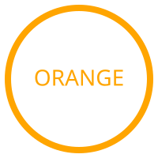
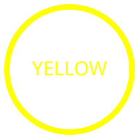
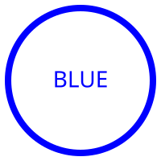
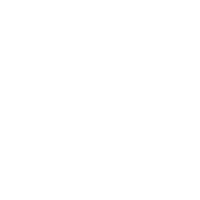

# NARC Lore Primer — Section 01: What NARC Is

> **Cross-references:** Section 02 (org structure), Section 03 (voice/tone), Section 07 (seals/images)

---

## 1. What NARC Is

**Full name:** Not A Real Company  
**Abbreviation:** NARC  
**Domain:** notarealcompany.enterprises[^1]  
**Nature:** A mock-corporate homelab environment. Real infrastructure and documentation, fictional corporate framing.[^1]  
**Founded:** 2025[^2] — canonical. Formal founding page planned as future deliverable.

### Tagline

> **"Making Fake Work Feel Real Since 2025"**

Appears in the `
` brand sub-header on every site page, in multiple document footers, and in the README.[^1]

### Footer Variants

The site uses several footer variants across pages.[^1]

| Page | Footer text |
|------|-------------|
| index.html | `© 2025 Not A Real Company (NARC) — Internal Use Only. All jokes reserved.` |
| leadership.html | `© 2025 Not A Real Company (NARC) — All rights pretend.` |
| departments.html | `© 2025 NARC — Making bureaucracy cool again.` |
| about.html | `© 2025 Not A Real Company — We take our fake mission very seriously.` |
| README footer | `"Where every ticket is mission-critical, every document is confidential, and every smile is mandatory."` |

When writing content that requires a footer, match the register of the page. The `index.html` variant is the default for internal documents. `"All rights pretend."` is the most frequently cited in session content. **Footer variants are not fixed strings — they are variations on the theme.** New footers should follow the same deadpan corporate register; exact wording can vary per document or page context.

### Paranoia RPG / Alpha Complex Flavor

NARC operates with a deliberate **Alpha Complex** undertone drawn from the *Paranoia* tabletop RPG.[^1] The `R&D-Prototype-Internal-AlphaComplexMemos.md` project card explicitly names this framing, and it is used throughout the MCP media documents without challenge.

Key Paranoia-derived elements in active use:

| Element | Usage in NARC |
|---------|---------------|
| The Computer | Omnipresent. Visible in every seal and approval. Never named aloud.[^1][^3] |
| Employees | Term for all staff in formal documents; replaces "Citizens" (governmental framing, retired).[^3] |
| Clearance levels (colors) | Access tiers for documents and systems. Full Paranoia spectrum in use: Infrared, Red, Orange, Yellow, Green, Blue, Indigo, Violet. Implementation mechanics undefined.[^2][^4] |
| Termination | Consequence label for serious violations; replaces "Treason / Treason Event" (RPG framing, retired).[^3] |
| Mandatory Fun | Chuck Cheerful's domain; also a tone element.[^1] |

---

**Clearance level spectrum confirmed in use:**  
| Clearance Level        | Hexcode   | Badge                                                        |
| ---------------------  | --------- | ------------------------------------------------------------ | 
| Infrared (lowest)      | #000000 |        |
| Red (employees)        | #FF0000 |                  |
| Orange                 | #FFA500 |            |
| Yellow                 | #FFFF00 |            |
| Green                  | #00FF00 |              |
| Blue                   | #0000FF |                |
| Indigo                 | #4B0082 |            |
| Violet (highest)       | #9400D3 |            |
| Ultraviolet (Reserved) | #FFFFFF |  |

**Ultraviolet** — reserved exclusively for the `[REDACTED]` Founder.[^2][^5].  
**Infrared** — reserved for non-employee access, such as contractors, vendors, or visitors.

---

### The Core Tone Rule

**Write as if the organization is real, serious, and slightly paranoid. Let the context do the comedy.**

The joke lives in the metadata, the framing, and the subject matter — not in the prose itself. Documents never wink at the camera. The author voice is a mid-level compliance officer who believes the procedures are reasonable.[^6]

---

[^1]: Site-confirmed — verified in NARC site source files (NARC-master.zip, 2026-03-22).
[^2]: Ratified — BR-001 lore-consolidation review, 2026-03-22.
[^3]: Ruling — BR-001 lore-consolidation review, 2026-03-22. Supersedes prior session-established usage.
[^4]: Site-confirmed (partial) — individual clearance colors confirmed in site content; full Paranoia spectrum ratified BR-001, 2026-03-22.
[^5]: This is a distinct use of `[REDACTED]` separate from the ITCRuD Director — two separate redacted identities; do not conflate them.
[^6]: Site-confirmed — derived from analysis of actual site documents (NARC-master.zip, 2026-03-22). 